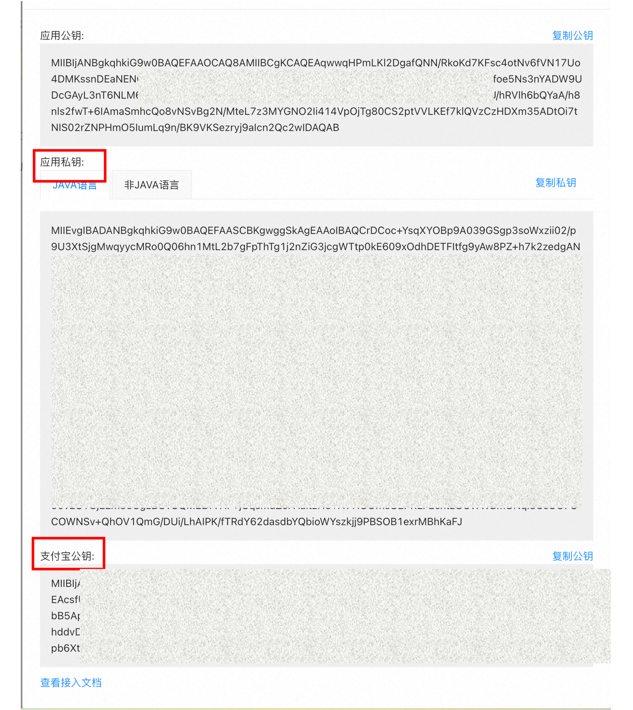
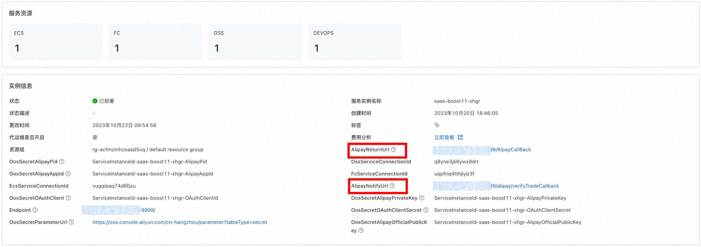
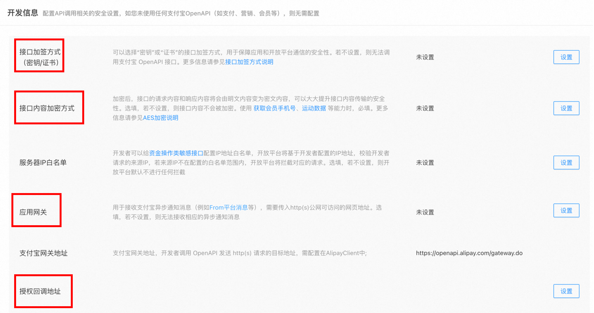

# SaaS Boost使用与开发文档

## 介绍

计算巢SaaS
Boost是由阿里云推出的一款开发工具和框架，旨在帮助软件即服务（SaaS）开发者快速构建、部署、扩展和售卖SaaS应用程序。它提供了一组开箱即用的功能和组件，使用户聚焦于业务逻辑的开发，而极大地降低SaaS应用程序开发的复杂性和成本。
计算巢SaaS Boost提供了许多功能，包括：

1. 计算巢能力：SaaS Boost底层为阿里云计算巢，可加速软件服务商在云上的部署、交付和管理服务, 实现一周上云。
2. 多租户架构：SaaS Boost为多租户应用程序提供了强大的多租户数据隔离和管理功能，使得开发者可以轻松地构建和管理多个租户的数据。
3. 持续集成和持续交付（CI/CD）能力：计算巢SaaS Boost提供了云效流水线，支持CI/CD能力，使开发者能够实现自动化的代码构建、测试和部署。可快速迭代和交付新功能，提高开发效率和产品质量。
4. 套餐管理：SaaS Boost提供了多套餐配置，允许开发者灵活地定义和管理不同套餐，并处理套餐的计费和配额。
5. SaaS应用程序监控：SaaS Boost提供了监控功能，帮助开发者跟踪和分析应用程序的性能和运行状况，并及时发现和解决问题。

## SaaS Boost快速部署

### 前提条件

使用阿里云计算巢SaaS Boost服务实例，需要对部分阿里云资源进行访问和创建操作。因此您的账号需要包含如下资源的权限。
**说明**：当您的账号是RAM账号时，才需要添加此权限。

| 权限策略名称                              | 备注                         |
|-------------------------------------|----------------------------|
| AliyunECSFullAccess                 | 管理云服务器服务（ECS）的权限           |
| AliyunVPCFullAccess                 | 管理专有网络（VPC）的权限             |
| AliyunROSFullAccess                 | 管理资源编排服务（ROS）的权限           |
| AliyunCloudMonitorFullAccess        | 管理云监控（CMS）的权限              |
| AliyunOSSFullAccess                 | 管理对象存储服务(OSS)的权限           |
| AliyunOOSFullAccess                 | 管理运维编排服务(OOS)的权限           |
| AliyunFCFullAccess                  | 管理函数计算(FC)服务的权限            |
| AliyunOTSFullAccess                 | 管理表格存储服务(OTS)的权限           |
| AliyunComputeNestSupplierFullAccess | 管理计算巢服务（ComputeNest）的商家侧权限 |

### 计费说明

计算巢SaaS Boost部署涉及的费用主要涉及：

- 云服务器服务（ECS）费用
- 表格存储（OTS）费用
- 函数计算（FC）费用
- 对象存储（OSS）费用
- 流量带宽费用

### 参数说明

| 参数组       | 参数项                     | 说明                                                                         |
|-----------|-------------------------|----------------------------------------------------------------------------|
| 服务实例      | 服务实例名称                  | 长度不超过64个字符，必须以英文字母开头，可包含数字、英文字母、短划线（-）和下划线（_）                              |
|           | 地域                      | 服务实例部署的地域                                                                  |
| 待部署的计算巢服务 | 计算巢服务Id                 | 待部署的用户企业的计算巢服务Id                                                           |                                                  |
| 支付宝（沙箱）配置 | AlipayAppId             | 支付宝（沙箱）应用ID                                                                |
|           | AlipayPid               | 支付宝（沙箱）应用商家Id                                                              |
|           | AlipayPrivateKey        | 支付宝（沙箱）应用私钥                                                                |
|           | AlipayOfficialPublicKey | 支付宝官方应用公钥                                                                  |
| 流水线配置     | 企业                      | 选择/新建您的企业                                                                  |
|           | GitHub服务连接              | 连接到GitHub的凭证。可通过账号密码方式创建                                                   |
|           | GitRepoEndpoint         | 仓库地址                                                                       |
| 付费类型配置    | 付费类型                    | 按量付费/包年包月                                                                  |
| ECS实例配置   | 实例类型                    | 部署的ECS实例类型                                                                 |
|           | 实例密码                    | 服务器登录密码,长度8-30，必须包含三项（大写字母、小写字母、数字、 ()`~!@#$%^&*_-+=｜{}[]:;'<>,.?/ 中的特殊符号） |
| 可用区配置     | 交换机可用区                  | 该实例类型可部署的可用区                                                               |
| 网络配置      | 是否新建VPC                 | 选择是否在当前可用区新建VPC                                                            |
|           | 专有网络VPC实例Id             | 选择当前可用区下的VPC实例                                                             |
|           | 交换机实例Id                 | 选择当前VPC支持的交换机                                                              |

### 部署流程

部署计算巢SaaS Boost的流程如下：

#### 1. **创建计算巢服务**

1. **配置您的SaaS应用（计算巢Service）**：
    - 创建您的计算巢Service。见文档[快速创建服务](#快速创建服务)

#### 2. **Fork当前仓库**

Fork当前仓库到您的个人仓库

#### 3. **创建支付宝沙箱账号**

指引图片中被红框框住的参数在创建服务实例中会被使用到。创建支付宝沙箱账号和创建计算巢服务实例步骤可颠倒顺序。

1. 按照[支付宝沙箱文档](https://open.alipay.com/develop/sandbox/app)中的说明，创建支付宝沙箱账号。其中应用网关地址和授权回调地址待创建好服务实例后回填。

   

2. 保留支付宝沙箱应用的私钥和支付宝的官方公钥

   

#### 4. **创建计算巢服务实例**

1. 访问[计算巢控制台](https://computenest.console.aliyun.com/)选择SaaS Boost一键部署服务
2. 按照提示填写部署参数
    1. 选择要部署的服务。
    2. 选择部署地域
    3. 填入支付宝沙箱信息（可跳过）
       

    4. 在流水线配置中，创建您的企业。根据前文fork的仓库信息创建Git连接凭证，填入前文fork的仓库地址。

       

    5. 选择付费类型和想要部署的Ecs实例规格及部署可用区
       
    6. 选择/新建专有网络(VPC)和交换机(VSW)
       

3. 确认同意服务协议并点击**立即创建**
   进入部署阶段。

   

4. 服务实例创建好后回填参数(可跳过)
    1. 在部署的实例信息中将AlipayNotifyUrl和AlipayReturnUrl分别回填到支付宝沙箱应用配置中的应用网关地址和授权回调地址(
       步骤2.1)

       

#### 5. **访问计算巢SaaS Boost服务**

点击部署好的服务实例详情页的Endpoint即可访问示例SaaS Boost界面。


### 使用

一旦计算巢SaaS Boost部署完成，您就可以开始使用它来开发、部署和销售您的软件应用程序。以下是一些关键的使用说明：

1. 配置/修改服务的套餐（可选）
    - 在application-*.properties文件中配置套餐
    - 重新运行流水线，完成SaaS应用的部署。

2. **支付宝沙箱测试（必选）**：在正式售卖前，请利用支付宝沙箱APP测试售卖能力。
    1. 如果在创建计算巢服务实例处选择跳过配置支付宝信息。则在使用前需要进行配置。见"对支付宝服务的配置进行修改"一节
    2. 在支付宝沙箱工具中下载支付宝客户端沙箱版安卓APP

       

    3. 选择想要创建的服务实例套餐

       

    4. 使用沙箱应用中提供的账号密码进行支付测试。

    5. 查看已部署的服务实例详情

       

    6. 查看已部署服务实例监控

       

    7. 查看历史订单

       

3. 在通过沙箱测试后，务必再次使用正式的支付宝账号进行售卖测试。
    1. 访问[支付宝开发者控制台](https://open.alipay.com/develop/manage)
    2. 创建网页/移动应用
    3. 按照提示填写应用名称，商家账号和图标
    4. 依次配置如下参数
   
       1. 选择接口加密。方式选择密钥加密
       2. 下载官方密钥生辰工具。按照图中提示进行配置
       3. 将得到的公钥上传
       4. 下载支付宝公钥
       5. 设置接口加密方式为AES
       6. 设置应用网关地址，即支付后支付宝校验的回调地址
       7. 设置授权回调地址，即支付后支付宝重定向的页面
       8. 将boost.common包中配置的沙箱支付宝网关地址修改为如图所示的正式版网关地址。将配置文件中的支付宝沙箱官方公钥替换为正式版公钥。
       9. 将您自己的应用私钥和支付宝应用公钥在OOS参数仓库进行修改
       10. 重新运行流水线
   5. 进行正式支付宝的购买测试

## 开发者指南

### 快速创建服务

如果您还没有为您即将售卖的软件创建计算巢服务。请基于以下文档快速创建计算巢服务。

1. 登录到计算巢控制台，选择"新建服务"

   
2. 仿照下图配置，选择托管版服务和Spring Boot服务。

   
3. 填写配置参数

   
4. 点击"创建服务"，等待服务创建成功。
5. 后续当您想对您软件部署物进行修改时，可对该服务进行编辑，重新选择部署物。

   

### 修改配置参数

在创建SaaS Boost一键部署实例时，我们配置了一些加密参数。如认证服务-OAuth的Client Id和Client
Secret，以及支付宝处的私钥，公钥，应用网关地址和授权回调地址。

当您需要对这些修改时请遵循一下操作：

#### 对OAuth 服务的配置进行修改

1. 打开部署的服务实例详情页面，复制OAuth 服务的Client Id和Client Secret。如红框所示。

   

2. 在阿里云控制台，访问运维编排-OOS工作台。点击参数仓库。

   

3. 选择地域为服务实例部署地域，点击加密参数栏，在搜索框中搜索OOS加密参数名

   

4. 点击进入加密参数编辑界面进行修改和保存即可。

#### 对支付宝服务的配置进行修改

支付宝的配置项包括支付宝公钥、支付宝私钥、支付宝网关地址、授权回调地址。

1. 对支付宝配置修改的前述步骤与"OAuth配置修改"的步骤（1-4）一致。

2. 需要登录到支付宝（沙箱）控制台。对应用网关地址，授权回调地址和应用公钥进行修改和设置。

   

3. 在对OOS参数仓库加密参数修改完后。需要在支付宝处回填参数。同"服务实例创建的第四步"

### 套餐管理

通过套餐设置功能，服务商可以将服务中的部分或全部参数配置为套餐，以供用户选择，避免用户在一个服务中配置较多参数导致的用户学习成本太高或者选配出错。

服务商可以配置多个套餐，给用户提供不同场景的最佳配置实践。

在创建服务实例时，必须选择一个套餐，再配置套餐外的参数即可创建服务实例。

#### 如何配置套餐

在SaaS Boost中，基于计算巢的套餐功能，做了一些降低用户学习成本的功能。

##### 不需要套餐管理的服务

如果您的服务不需要套餐管理，在计算巢控制台处则无需配置套餐。只需要在SaaS
Boost的boost.common路径下的application-*.properties，路径为(
./../boost.common/src/main/resources/application-test.properties)
配置文件中，对该服务进行定价即可，即修改如下部分：

```yaml
nest.service-configs[0].specifications[0].month-price=自定义
nest.service-configs[0].specifications[0].year-price=自定义
```

在这种情况中，该服务模版暴露的所有的参数都需要用户亲自进行填写。

##### 需要套餐管理的服务

如图所示：

当您的套餐包含多个需要填写的参数时，建议您通过图中的方法，将套餐与某些参数关联，如ECS实例类型。这有助于降低用户填写参数的难度，使他们能够更快地完成购买和使用软件。如果您使用了计算巢的套餐功能，请在boost.common路径下的application-*
.properties文件中，为价格和套餐名进行配置。

在对套餐名进行配置时，请确保配置文件中的specification-name和控制台的名字完全一致。

示例如下：

```yaml
nest.service-configs[0].specifications[1].specification-name=Entry Level Package
nest.service-configs[0].specifications[1].month-price=20.0
nest.service-configs[0].specifications[1].year-price=200.0
nest.service-configs[0].specifications[2].specification-name=Standard Package
nest.service-configs[0].specifications[2].month-price=30.0
nest.service-configs[0].specifications[2].year-price=300.0
```

##### 自定义参数


如果您希望让用户对某些参数重新填写时,比如上图的ECS实例密码，SaaS Boost也提供了DIY功能，可以通过简单的前端配置，即可实现对默认参数的重填。
配置文件路径为：specificationConfig.tsx，路径为(./../boost.front/src/specificationConfig.tsx)中。示例如下：

```tsx
export const CustomParameters: ParameterTypeInterfaceArray = {

    InstancePassword: {
        Type: 'String',
        NoEcho: true,
        Label: {
            en: 'Instance Password',
            'zh-cn': '实例密码',
        },
        Default: '123456aA',
        AllowedPattern: "[0-9A-Za-z_\\-&:;''<>,=%`~!@#\\(\\)\\$\\^\\*\\+\\|\\{\\}\\[\\]\\.\\?\\/]+$"
    },
};
```

更多信息见ParameterTypeInterfaceArray接口吗，路径为(
../boost.front/src/pages/ServiceInstanceList/components/interface/ServiceMetadataInterface.tsx)。

通过这样的方式即可实现参数的DIY配置。需要注意的是，自己DIY的参数需要与您的计算巢服务模版中的名称和类型一致。
更详细的信息见计算巢官方文档：[配置套餐](https://help.aliyun.com/zh/compute-nest/create-package-settings-for-a-service)